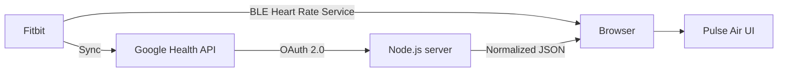

<div align="center">

# Pulse Air

### Fitbitの鼓動を、ひとつの静かなダッシュボードに。

[](https://nodejs.org/)
[](package.json)
[](LICENSE)

Web Bluetoothのライブ心拍数とGoogle Healthの最新値を、自動で切り替えて表示するローカルWebアプリです。

</div>

> [!IMPORTANT]
> 本アプリはフィットネス表示・学習用途です。医療上の診断や判断には使用できません。

## Features

- **Bluetooth Live** — 標準BLE Heart Rate Serviceからリアルタイムに受信
- **Google Health** — 離れた場所ではクラウドに同期された最新値を表示
- **Automatic fallback** — Bluetoothが5秒以上途切れるとクラウド値へ自動切替
- **Privacy first** — OAuth secretやtokenをブラウザへ渡さず、健康データを保存しない
- **Zero dependencies** — Node.js標準機能とVanilla HTML / CSS / JavaScriptだけで動作
- **Responsive UI** — モバイルからデスクトップまで見やすいダークダッシュボード

## Quick start

必要なのは **Node.js 20以上** だけです。

```bash
git clone https://github.com/taku0193/fitbit-air-heart-rate.git
cd fitbit-air-heart-rate
cp .env.example .env
npm start
```

[http://localhost:3217](http://localhost:3217) を開いてください。外部パッケージがないため、`npm install`は不要です。

### Bluetoothで接続する

1. Fitbit側で心拍数共有を開始します。
2. Web Bluetooth対応のChrome系ブラウザからlocalhostまたはHTTPSで開きます。
3. **心拍計に接続**を押し、デバイスを選びます。

Web Bluetoothはユーザー操作とsecure contextを要求します。FirefoxとSafariは対象外です。

### Google Healthを設定する

1. Google CloudでGoogle Health APIを有効にします。
2. OAuth 2.0のWeb application clientを作成します。
3. Authorized redirect URIに `http://localhost:3217/oauth2/callback` を登録します。
4. 読み取りscopeを追加し、`.env`へclient情報を設定します。

```env
GOOGLE_HEALTH_CLIENT_ID=your-client-id
GOOGLE_HEALTH_CLIENT_SECRET=your-client-secret
GOOGLE_HEALTH_REDIRECT_URI=http://localhost:3217/oauth2/callback
GOOGLE_HEALTH_REFRESH_TOKEN=
PORT=3217
```

使用するscope：

```text
https://www.googleapis.com/auth/googlehealth.health_metrics_and_measurements.readonly
```

設定後に再起動し、画面の **Google Healthを認証** から認可してください。Google OAuthがTesting状態の場合、refresh tokenは通常7日で期限切れになります。

## How it works



表示データの優先順位は次の通りです。

1. Bluetooth接続中で、最後の通知から5秒以内のライブ値
2. Google Health APIから取得した最新値
3. どちらもなければ「データなし」

クラウド値はリアルタイムとは限らないため、測定時刻と受信時刻を分けて表示し、測定から15分を超えると警告します。

## API

### `GET /api/config`

OAuthの設定・認証状態だけを返します。secretやtokenは含みません。

### `GET /api/heart-rate/latest`

Google Healthのレスポンスを最小形式へ変換します。値がなければ `null` です。

```json
{
  "bpm": 121,
  "measuredAt": "2026-07-14T13:58:10Z",
  "receivedAt": "2026-07-14T14:10:32Z",
  "source": "cloud-api"
}
```

## Development

```bash
npm run dev     # ファイル変更を監視して起動
npm test        # ユニットテスト
npm run check   # JavaScript構文検査
```

テストでは、Bluetooth 8/16bit値の解析、取得元の切替、Google Healthレスポンス変換、OAuth更新、401再試行、通信失敗、レート制限を確認します。

## Project structure

```text
fitbit-air-heart-rate/
├── public/
│   ├── app.js            # UI状態とデータ取得
│   ├── bluetooth.js      # Web Bluetooth接続
│   ├── heart-rate.js     # データ選択ロジック
│   ├── index.html
│   └── style.css
├── server/
│   ├── env.js
│   ├── google-health.js  # OAuth / Google Health API
│   └── server.js
├── test/
├── .env.example
└── package.json
```

## Security notes

- `.env`、access token、refresh tokenはGitへ追加しないでください。
- tokenとAPIの生レスポンスはログへ出力しません。
- 心拍数データはサーバー・ブラウザの永続ストレージへ保存しません。
- 公開サービスとして運用する場合は、TLS、ユーザー別の暗号化token store、CSRF対策、プライバシー開示、削除手段、GoogleのOAuth検証が別途必要です。

## References

- [Google Health API](https://developers.google.com/health)
- [Google Health API data types](https://developers.google.com/health/data-types)
- [Web Bluetooth API — MDN](https://developer.mozilla.org/docs/Web/API/Web_Bluetooth_API)
- [Communicating with Bluetooth devices — Chrome for Developers](https://developer.chrome.com/docs/capabilities/bluetooth)

## License

[MIT License](LICENSE)
