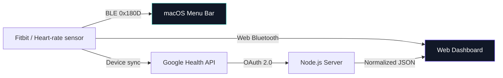

<div align="center">

# ♥ Pulse Air

### Your heartbeat, one glance away.

Fitbitの心拍数を、MacのメニューバーとWebダッシュボードへ。<br>
Bluetoothのライブ値も、Google Healthの最新値も、静かでシンプルに表示します。

[](#macos-menu-bar)
[](#web-dashboard)
[](package.json)
[](LICENSE)

</div>

> [!IMPORTANT]
> Pulse Airはフィットネス表示・学習用途のアプリです。医療上の診断や判断には使用できません。

## Choose your view

| | macOS Menu Bar | Web Dashboard |
|---|---|---|
| 使い方 | メニューバーで常時確認 | ブラウザで詳細表示 |
| ライブ値 | CoreBluetooth | Web Bluetooth |
| Google Health | — | 対応 |
| 表示 | `♥ 72` + ミニパネル | BPM・取得元・測定時刻 |
| データ保存 | なし | なし |
| 外部ライブラリ | なし | なし |

## Highlights

- **Living heart** — メニューバーのハートが「ドクン、ドクン」と動き、接続中はBPMに同期
- **Bluetooth live** — 標準BLE Heart Rate Serviceから心拍数を直接受信
- **Cloud fallback** — Web版はBluetoothが途切れるとGoogle Healthの最新値へ自動切替
- **Local & private** — 心拍数を永続保存せず、OAuth secretやtokenをブラウザへ渡さない
- **Zero dependencies** — SwiftUI / CoreBluetooth / Node.js標準機能だけで動作
- **Small by design** — macOSアプリは約250KB、UIは必要な情報と操作だけ

## macOS Menu Bar

メニューバーに現在の心拍数を表示するネイティブアプリです。Dockには現れず、クリックすると小さな操作パネルだけが開きます。

```text
♥ 72  →  Current BPM / Connection / Connect / Quit
```

### Requirements

- macOS 13 Ventura以降
- Xcode、またはmacOS SDKと一致するXcode Command Line Tools
- 標準Bluetooth Heart Rate Serviceを公開する心拍計

### Build & launch

```bash
git clone https://github.com/taku0193/fitbit-air-heart-rate.git
cd fitbit-air-heart-rate

npm run test:macos
npm run build:macos
open "macos/PulseAirMenuBar/dist/Pulse Air.app"
```

初回起動時にmacOSのBluetooth利用を許可し、メニューバーのハートから **心拍計に接続** を選択してください。

生成されるアプリはローカル実行用のad-hoc署名です。他のMacへ配布する場合はApple Developer IDによる署名とnotarizationが必要です。

## Web Dashboard

Bluetoothのライブ値とGoogle Healthへ同期された最新値を、同じ画面で確認できます。

### Quick start

```bash
cp .env.example .env
npm start
```

[http://localhost:3217](http://localhost:3217) を開いてください。外部パッケージがないため、`npm install`は不要です。

### Data priority

1. Bluetooth接続中かつ、最後の通知から5秒以内のライブ値
2. Google Health APIから取得した最新値
3. どちらもなければ「データなし」

クラウド値はリアルタイムとは限りません。測定時刻と受信時刻を分け、測定から15分を超えると警告します。

### Google Health setup

1. Google CloudでGoogle Health APIを有効化
2. OAuth 2.0 Web application clientを作成
3. Redirect URIへ `http://localhost:3217/oauth2/callback` を登録
4. 読み取りscopeを追加し、`.env`を設定

```env
GOOGLE_HEALTH_CLIENT_ID=your-client-id
GOOGLE_HEALTH_CLIENT_SECRET=your-client-secret
GOOGLE_HEALTH_REDIRECT_URI=http://localhost:3217/oauth2/callback
GOOGLE_HEALTH_REFRESH_TOKEN=
PORT=3217
```

```text
https://www.googleapis.com/auth/googlehealth.health_metrics_and_measurements.readonly
```

設定後にサーバーを再起動し、画面の **Google Healthを認証** から認可してください。

## Architecture



Bluetoothの8bit / 16bit Heart Rate Measurementを共通の範囲検証付きで解析します。macOS版はCoreBluetooth、Web版はWeb Bluetoothを使用します。

## API

### `GET /api/config`

Google Health OAuthの設定・認証状態だけを返します。secretやtokenは含みません。

### `GET /api/heart-rate/latest`

Google Healthのレスポンスを次の最小形式へ正規化します。値がなければ `null` です。

```json
{
  "bpm": 121,
  "measuredAt": "2026-07-14T13:58:10Z",
  "receivedAt": "2026-07-14T14:10:32Z",
  "source": "cloud-api"
}
```

## Development

```bash
# Web
npm run dev
npm test
npm run check

# macOS
npm run test:macos
npm run build:macos
```

| Check | Coverage |
|---|---|
| `npm test` | Bluetooth解析、取得元切替、Google Health変換、OAuth更新、APIエラー |
| `npm run test:macos` | 8/16bit解析、短いデータ、不正な心拍数 |
| `npm run check` | Web / server JavaScript構文検査 |

## Project map

```text
fitbit-air-heart-rate/
├── macos/PulseAirMenuBar/
│   ├── Sources/PulseAirCore/          # 心拍データ解析
│   ├── Sources/PulseAirMenuBar/       # NSStatusItem / SwiftUI / Bluetooth
│   ├── Sources/PulseAirMenuBarSelfTest/
│   └── build-app.sh
├── public/                             # Web UI / Web Bluetooth
├── server/                             # OAuth / Google Health API
├── test/                               # Node.js tests
├── .env.example
└── package.json
```

## Privacy & security

- `.env`、access token、refresh tokenはGit対象外です。
- tokenとGoogle Health APIの生レスポンスをログへ出力しません。
- 心拍数はサーバー、ブラウザ、macOSアプリの永続ストレージへ保存しません。
- 公開サービスとして運用する場合は、TLS、ユーザー別の暗号化token store、CSRF対策、プライバシー開示、削除手段、GoogleのOAuth検証が別途必要です。

## References

- [Google Health API](https://developers.google.com/health)
- [Google Health data types](https://developers.google.com/health/data-types)
- [Web Bluetooth API — MDN](https://developer.mozilla.org/docs/Web/API/Web_Bluetooth_API)
- [Core Bluetooth — Apple Developer](https://developer.apple.com/documentation/corebluetooth)

## License

Released under the [MIT License](LICENSE).
